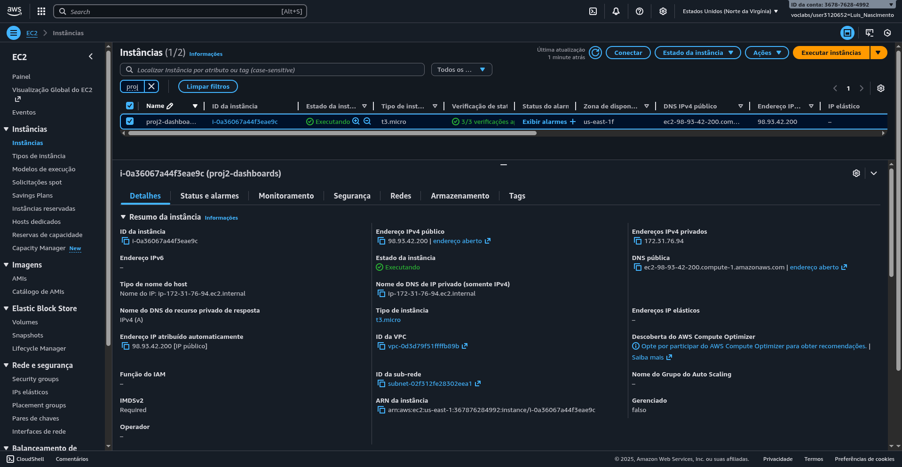
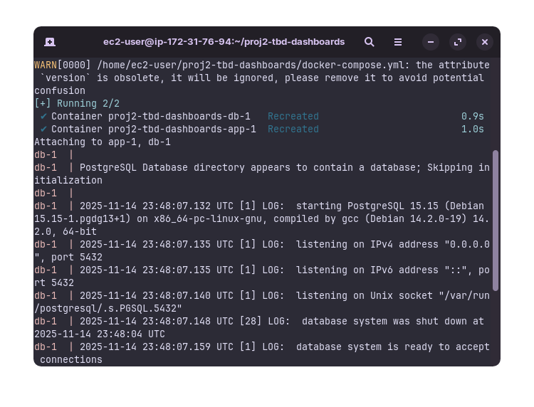
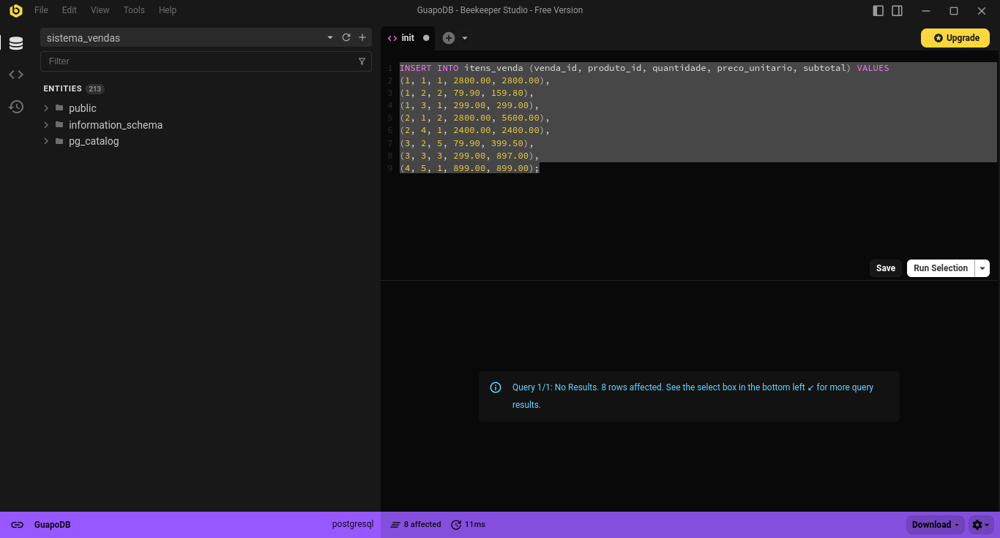
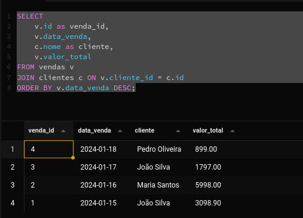
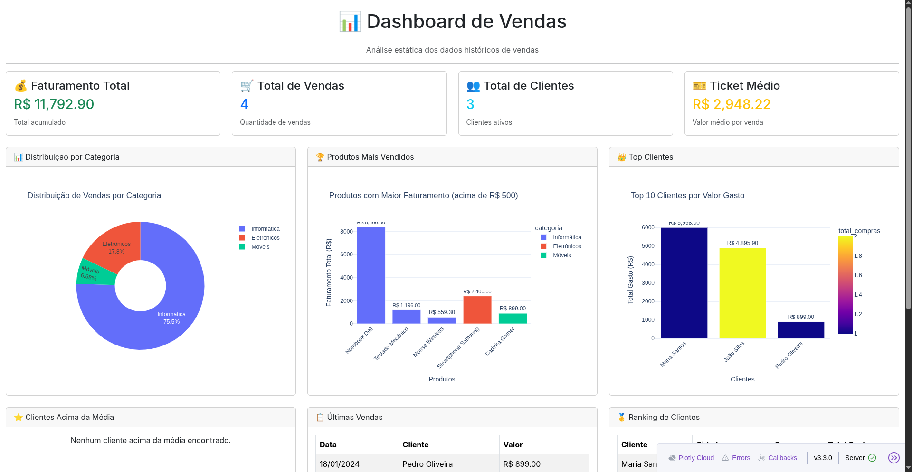

# Relatório de Integração entre Projetos de Serviços em Nuvem e Tópicos em Banco de Dados

**Professor:** Jamilson Bispo dos Santos
**Grupo:**
  - Luis Felipe - RA: 10420572
  - Arthur Jones - RA: 10420317

---

## 1. Introdução

Este relatório apresenta a integração entre as disciplinas de **Serviços em Nuvem** e **Tópicos em Banco de Dados** através de um projeto comum que utiliza tecnologias de nuvem para hospedar um sistema de dashboard de vendas com banco de dados PostgreSQL.

O projeto consiste em uma aplicação web de dashboard desenvolvida em Python (Dash) que se conecta a um banco de dados PostgreSQL, ambos containerizados usando Docker e Docker Compose, demonstrando práticas de serviços em nuvem e manipulação de dados.

---

## 2. Componentes Avaliativos

### 2.1 Disciplina: Serviços em Nuvem

#### 2.1.1 Máquina Virtual e Ambiente de Banco de Dados

O ambiente foi criado utilizando **Docker Compose** para orquestração de containers, para viabilizar uma infraestrutura em nuvem. O projeto utiliza dois serviços principais:

- **Serviço de Banco de Dados (db):** Container PostgreSQL 15
- **Serviço de Aplicação (app):** Container Python 3.11 com aplicação Dash

**Configuração do Docker Compose:**
- Banco de dados PostgreSQL na porta `5435` (host) mapeada para `5432` (container)
- Aplicação web na porta `8010`
- Variáveis de ambiente configuradas para conexão entre serviços



**Arquivo `docker-compose.yml`:**
```yaml
version: '3.8'

services:
  db:
    build: ./db
    restart: unless-stopped
    environment:
      - POSTGRES_USER=postgres
      - POSTGRES_PASSWORD=postgres
      - POSTGRES_DB=dashboard_db
    ports:
      - "5435:5432"

  app:
    build: ./app
    depends_on:
      - db
    ports:
      - 8010:8010
    volumes:
      - ./app:/app
    environment:
      - DB_HOST=db
      - DB_USER=postgres
      - DB_PASSWORD=postgres
      - DB_NAME=sistema_vendas
```

#### 2.1.2 Procedimentos de Criação das Tabelas (CREATE)

O banco de dados `sistema_vendas` foi criado com o seguinte esquema relacional:

**Estrutura das Tabelas:**

1. **Tabela `clientes`:**
   - Armazena informações dos clientes
   - Campos: id, nome, email, telefone, data_cadastro, cidade, estado

2. **Tabela `categorias`:**
   - Armazena categorias de produtos
   - Campos: id, nome, descricao

3. **Tabela `produtos`:**
   - Armazena informações dos produtos
   - Campos: id, nome, descricao, preco_custo, preco_venda, estoque, categoria_id, data_cadastro
   - Relacionamento com `categorias` via chave estrangeira

4. **Tabela `vendas`:**
   - Armazena registros de vendas
   - Campos: id, cliente_id, data_venda, valor_total, status
   - Relacionamento com `clientes` via chave estrangeira

5. **Tabela `itens_venda`:**
   - Armazena itens individuais de cada venda
   - Campos: id, venda_id, produto_id, quantidade, preco_unitario, subtotal
   - Relacionamentos com `vendas` e `produtos` via chaves estrangeiras

**Script SQL de Criação (`db/init.sql`):**

```sql
-- Criar o banco de dados
CREATE DATABASE sistema_vendas;
\c sistema_vendas;

-- Tabela de Clientes
CREATE TABLE clientes (
    id SERIAL PRIMARY KEY,
    nome VARCHAR(100) NOT NULL,
    email VARCHAR(100) UNIQUE,
    telefone VARCHAR(20),
    data_cadastro DATE DEFAULT CURRENT_DATE,
    cidade VARCHAR(50),
    estado VARCHAR(2)
);

-- Tabela de Categorias
CREATE TABLE categorias (
    id SERIAL PRIMARY KEY,
    nome VARCHAR(50) NOT NULL,
    descricao TEXT
);

-- Tabela de Produtos
CREATE TABLE produtos (
    id SERIAL PRIMARY KEY,
    nome VARCHAR(100) NOT NULL,
    descricao TEXT,
    preco_custo DECIMAL(10,2),
    preco_venda DECIMAL(10,2),
    estoque INTEGER DEFAULT 0,
    categoria_id INTEGER REFERENCES categorias(id),
    data_cadastro DATE DEFAULT CURRENT_DATE
);

-- Tabela de Vendas
CREATE TABLE vendas (
    id SERIAL PRIMARY KEY,
    cliente_id INTEGER REFERENCES clientes(id),
    data_venda DATE DEFAULT CURRENT_DATE,
    valor_total DECIMAL(10,2),
    status VARCHAR(20) DEFAULT 'finalizada'
);

-- Tabela de Itens da Venda
CREATE TABLE itens_venda (
    id SERIAL PRIMARY KEY,
    venda_id INTEGER REFERENCES vendas(id),
    produto_id INTEGER REFERENCES produtos(id),
    quantidade INTEGER NOT NULL,
    preco_unitario DECIMAL(10,2),
    subtotal DECIMAL(10,2)
);
```



#### 2.1.3 Procedimentos para Inserção de Dados (INSERT)

Os dados foram inseridos seguindo a ordem de dependências das chaves estrangeiras:

**Inserção de Categorias:**
```sql
INSERT INTO categorias (nome, descricao) VALUES
('Eletrônicos', 'Produtos eletrônicos em geral'),
('Informática', 'Computadores e periféricos'),
('Móveis', 'Móveis para escritório');
```

**Inserção de Produtos:**
```sql
INSERT INTO produtos (nome, descricao, preco_custo, preco_venda, estoque, categoria_id) VALUES
('Notebook Dell', 'Notebook Dell i5 8GB', 2000.00, 2800.00, 15, 2),
('Mouse Wireless', 'Mouse sem fio', 30.00, 79.90, 50, 2),
('Teclado Mecânico', 'Teclado mecânico RGB', 120.00, 299.00, 25, 2),
('Smartphone Samsung', 'Samsung Galaxy S20', 1800.00, 2400.00, 30, 1),
('Cadeira Gamer', 'Cadeira gamer ergonômica', 450.00, 899.00, 10, 3);
```

**Inserção de Clientes:**
```sql
INSERT INTO clientes (nome, email, telefone, cidade, estado) VALUES
('João Silva', 'joao@email.com', '(11)9999-8888', 'São Paulo', 'SP'),
('Maria Santos', 'maria@email.com', '(21)8888-7777', 'Rio de Janeiro', 'RJ'),
('Pedro Oliveira', 'pedro@email.com', '(31)7777-6666', 'Belo Horizonte', 'MG');
```

**Inserção de Vendas:**
```sql
INSERT INTO vendas (cliente_id, data_venda, valor_total) VALUES
(1, '2024-01-15', 3098.90),
(2, '2024-01-16', 5998.00),
(1, '2024-01-17', 1797.00),
(3, '2024-01-18', 899.00);
```

**Inserção de Itens de Venda:**
```sql
INSERT INTO itens_venda (venda_id, produto_id, quantidade, preco_unitario, subtotal) VALUES
(1, 1, 1, 2800.00, 2800.00),
(1, 2, 2, 79.90, 159.80),
(1, 3, 1, 299.00, 299.00),
(2, 1, 2, 2800.00, 5600.00),
(2, 4, 1, 2400.00, 2400.00),
(3, 2, 5, 79.90, 399.50),
(3, 3, 3, 299.00, 897.00),
(4, 5, 1, 899.00, 899.00);
```



#### 2.1.4 Procedimento para Exibição de Dados (SELECT)

**Vendas com Informações de Clientes**
```sql
SELECT 
    v.id as venda_id,
    v.data_venda,
    c.nome as cliente,
    v.valor_total
FROM vendas v
JOIN clientes c ON v.cliente_id = c.id
ORDER BY v.data_venda DESC;
```



---

### 2.2 Disciplina: Tópicos em Banco de Dados

#### 2.2.1 Dashboard com Dois Tipos de Gráficos

Foi desenvolvido um dashboard interativo utilizando **Dash** (framework Python para aplicações web analíticas) que apresenta visualizações dos dados do banco de dados.

**Tecnologias Utilizadas:**
- **Dash:** Framework web para dashboards
- **Plotly:** Biblioteca para criação de gráficos interativos
- **Pandas:** Manipulação e análise de dados
- **SQLAlchemy:** ORM para conexão com PostgreSQL
- **Dash Bootstrap Components:** Componentes de UI estilizados

**Estrutura da Aplicação:**
- Arquivo principal: `app/main.py`
- Porta de acesso: `8010`
- Interface web responsiva com Bootstrap

**Gráficos Implementados:**

1. **Gráfico de Pizza (Pie Chart) - Distribuição de Vendas por Categoria**
   - Tipo: Gráfico de pizza com buraco central (donut chart)
   - Dados: Faturamento por categoria de produtos
   - Visualização: Percentual e valores por categoria

2. **Gráfico de Barras (Bar Chart) - Produtos Mais Vendidos**
   - Tipo: Gráfico de barras verticais
   - Dados: Produtos com faturamento acima de R$ 500,00
   - Visualização: Faturamento total por produto, colorido por categoria

3. **Gráfico de Barras (Bar Chart) - Top 10 Clientes**
   - Tipo: Gráfico de barras verticais
   - Dados: Top 10 clientes por valor total gasto
   - Visualização: Total gasto por cliente, colorido por número de compras


**Métricas Exibidas no Dashboard:**
- 💰 Faturamento Total
- 🛒 Total de Vendas
- 👥 Total de Clientes
- 🎫 Ticket Médio

**Tabelas Detalhadas:**
- Clientes Acima da Média
- Últimas Vendas
- Ranking de Clientes



**Código de Conexão com Banco de Dados:**
```python
# Configuração do banco de dados
DB_HOST = os.getenv('DB_HOST', 'db')
DB_PORT = os.getenv('DB_PORT', '5432')
DB_NAME = os.getenv('DB_NAME', 'sistema_vendas')
DB_USER = os.getenv('DB_USER', 'postgres')
DB_PASSWORD = os.getenv('DB_PASSWORD', 'postgres')

# Criar conexão com o banco
connection_string = f"postgresql+psycopg2://{DB_USER}:{DB_PASSWORD}@{DB_HOST}:{DB_PORT}/{DB_NAME}"
engine = create_engine(connection_string)
```

**Função de Execução de Queries:**
```python
def executar_query(query):
    """Executa uma query e retorna um DataFrame"""
    try:
        with engine.connect() as conn:
            return pd.read_sql(query, conn)
    except Exception as e:
        print(f"Erro na consulta: {e}")
        return pd.DataFrame()
```

---

## 3. Documentação dos Procedimentos

### 3.1 Procedimentos CREATE

Todos os procedimentos de criação de tabelas estão documentados no arquivo `db/init.sql` e são executados automaticamente na inicialização do container PostgreSQL.

**Comandos para executar manualmente:**
```bash
# Conectar ao banco de dados
psql -h localhost -p 5435 -U postgres -d sistema_vendas

# Executar script de criação
\i /docker-entrypoint-initdb.d/init.sql
```

### 3.2 Procedimentos INSERT

Os procedimentos de inserção estão incluídos no mesmo arquivo `db/init.sql` e populam o banco com dados de exemplo para demonstração do dashboard.

**Ordem de inserção (respeitando dependências):**
1. Categorias
2. Produtos
3. Clientes
4. Vendas
5. Itens de Venda

### 3.3 Procedimentos SELECT

Todas as queries SELECT estão implementadas no arquivo `app/main.py` e são executadas automaticamente quando o dashboard é carregado. As queries incluem:

- JOINs entre múltiplas tabelas
- Agregações (SUM, COUNT, AVG)
- Subconsultas (subquery)
- Filtros com HAVING
- Ordenação e limitação de resultados

---

## 4. Arquitetura do Projeto

### 4.1 Estrutura de Diretórios

```
proj2-tbd-dashboards/
├── app/
│   ├── Dockerfile
│   ├── main.py
│   └── requirements.txt
├── db/
│   ├── Dockerfile
│   └── init.sql
└── docker-compose.yml
```

### 4.2 Dependências

**Aplicação (`app/requirements.txt`):**
```
pandas
plotly
dash
sqlalchemy
psycopg2-binary
dotenv
dash-bootstrap-components
```

### 4.3 Configuração de Containers

**Container do Banco de Dados (`db/Dockerfile`):**
```dockerfile
FROM postgres:15

COPY ./init.sql /docker-entrypoint-initdb.d/init.sql

EXPOSE 5432
```

**Container da Aplicação (`app/Dockerfile`):**
```dockerfile
FROM python:3.11-slim

WORKDIR /app

COPY requirements.txt .

RUN pip install --no-cache-dir -r requirements.txt

COPY . .

CMD ["python", "main.py"]
```

### 4.4 Execução do Projeto

**Comandos para executar:**
```bash
# Subir os containers
docker-compose up -d

# Verificar logs
docker-compose logs -f

# Acessar o dashboard
# Navegador: http://localhost:8010

# Parar os containers
docker-compose down
```

---

## 5. Conclusão

Este projeto demonstra com sucesso a integração entre as disciplinas de **Serviços em Nuvem** e **Tópicos em Banco de Dados**, apresentando:

✅ Criação de ambiente virtualizado com Docker  
✅ Implementação de banco de dados relacional PostgreSQL  
✅ Procedimentos de criação, inserção e consulta de dados  
✅ Dashboard interativo com múltiplos tipos de gráficos  
✅ Documentação completa dos procedimentos SQL  

O projeto utiliza tecnologias modernas de containerização e visualização de dados, demonstrando boas práticas de desenvolvimento e arquitetura de sistemas em nuvem.
